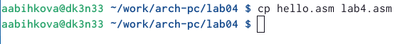

---
## Front matter
title: "Отчёт по лабораторной работе №4"
subtitle: "Дисциплина:Архитектура компьютера"
author: "Быкова Алина Александровна"

## Generic otions
lang: ru-RU
toc-title: "Содержание"

## Bibliography
bibliography: bib/cite.bib
csl: pandoc/csl/gost-r-7-0-5-2008-numeric.csl

## Pdf output format
toc: true # Table of contents
toc-depth: 2
lof: true # List of figures
lot: true # List of tables
fontsize: 12pt
linestretch: 1.5
papersize: a4
documentclass: scrreprt
## I18n polyglossia
polyglossia-lang:
  name: russian
  options:
	- spelling=modern
	- babelshorthands=true
polyglossia-otherlangs:
  name: english
## I18n babel
babel-lang: russian
babel-otherlangs: english
## Fonts
mainfont: PT Serif
romanfont: PT Serif
sansfont: PT Sans
monofont: PT Mono
mainfontoptions: Ligatures=TeX
romanfontoptions: Ligatures=TeX
sansfontoptions: Ligatures=TeX,Scale=MatchLowercase
monofontoptions: Scale=MatchLowercase,Scale=0.9
## Biblatex
biblatex: true
biblio-style: "gost-numeric"
biblatexoptions:
  - parentracker=true
  - backend=biber
  - hyperref=auto
  - language=auto
  - autolang=other*
  - citestyle=gost-numeric
## Pandoc-crossref LaTeX customization
figureTitle: "Рис."
tableTitle: "Таблица"
listingTitle: "Листинг"
lofTitle: "Список иллюстраций"
lotTitle: "Список таблиц"
lolTitle: "Листинги"
## Misc options
indent: true
header-includes:
  - \usepackage{indentfirst}
  - \usepackage{float} # keep figures where there are in the text
  - \floatplacement{figure}{H} # keep figures where there are in the text
---

# Цель работы

Освоение процедуры компиляции и сборки программ, написанных на ассемблере NASM.

# Выполнение лабораторной работы
Создала каталог в терминале для работы с программами на языке ассемблера NASM.

Создала текстовый файл с именем hello.asm.

Открыла файл с помощью команды gedit hello.asm и ввела в него текст.

Написала команду для компиляции приведённого выше текста программы «Hello World» и с помощью команды ls проверила, что объектный файл был создан.

Написала команду, которая скомпилировала исходный файл hello.asm в obj.o и с помощью команды ls проверила, что файлы были созданы.

Передала объектный файл на обработку компоновщику с помощью команды ld -m elf_i386 hello.o -o hello и с помощью команды ls проверила, что исполняемый файл hello был создан. 

Выполнила команду "ld -m elf_i386 obj.o -o main"

Запустила выполнение созданного исполняемого файла.

# Задания для самостоятельной работы

Создала копию файла hello.asm с именем lab4.asm

С помощью текстового редактора заменила "Hello world!" на "Быкова Алина".

Оттранслировала полученный текст программы lab4.asm в объектный файл.

# Выводы

Я освоила процедуры компиляции и сборки программ, написанных на ассемблере NASM.

