---
## Front matter
title: "Отчет по лабораторной работе №5"
subtitle: "Дисциплина:Архитектура компьютера"
author: "Быкова Алина Александровна"

## Generic otions
lang: ru-RU
toc-title: "Содержание"

## Bibliography
bibliography: bib/cite.bib
csl: pandoc/csl/gost-r-7-0-5-2008-numeric.csl

## Pdf output format
toc: true # Table of contents
toc-depth: 2
lof: true # List of figures
lot: true # List of tables
fontsize: 12pt
linestretch: 1.5
papersize: a4
documentclass: scrreprt
## I18n polyglossia
polyglossia-lang:
  name: russian
  options:
	- spelling=modern
	- babelshorthands=true
polyglossia-otherlangs:
  name: english
## I18n babel
babel-lang: russian
babel-otherlangs: english
## Fonts
mainfont: PT Serif
romanfont: PT Serif
sansfont: PT Sans
monofont: PT Mono
mainfontoptions: Ligatures=TeX
romanfontoptions: Ligatures=TeX
sansfontoptions: Ligatures=TeX,Scale=MatchLowercase
monofontoptions: Scale=MatchLowercase,Scale=0.9
## Biblatex
biblatex: true
biblio-style: "gost-numeric"
biblatexoptions:
  - parentracker=true
  - backend=biber
  - hyperref=auto
  - language=auto
  - autolang=other*
  - citestyle=gost-numeric
## Pandoc-crossref LaTeX customization
figureTitle: "Рис."
tableTitle: "Таблица"
listingTitle: "Листинг"
lofTitle: "Список иллюстраций"
lotTitle: "Список таблиц"
lolTitle: "Листинги"
## Misc options
indent: true
header-includes:
  - \usepackage{indentfirst}
  - \usepackage{float} # keep figures where there are in the text
  - \floatplacement{figure}{H} # keep figures where there are in the text
---

# Цель работы

Приобретение практических навыков работы в Midnight Commander. Освоение инструкций
языка ассемблера mov и int.

# Выполнение лабораторной работы

Открыла Midnight Commander с помощью команды "mc".

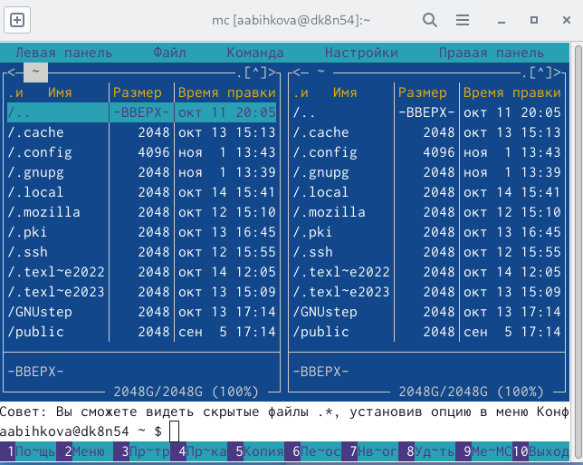

Перешла в каталог ~/work/arch-pc.

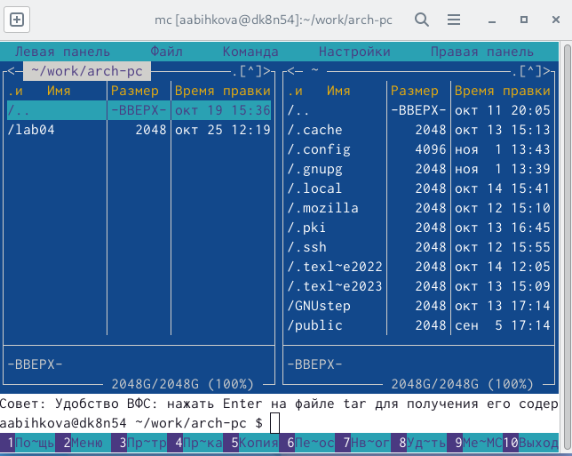

С помощью функциональной клавиши F7 создала папку lab05 и перешла в эту папку.

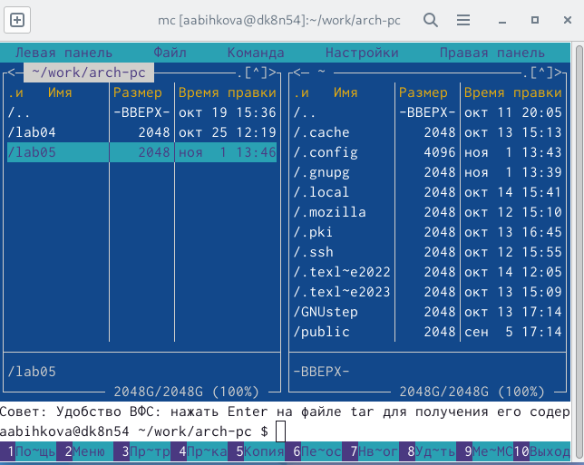

Пользуясь строкой ввода и командой touch создала файл lab5-1.asm.

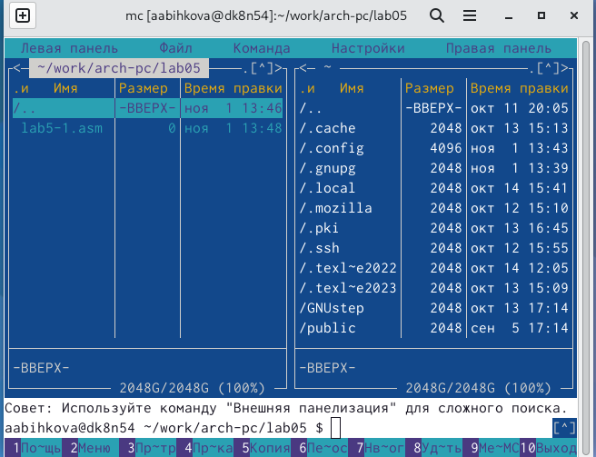

С помощью функциональной клавиши F4 открыла файл lab5-1.asm для редактирования и ввела текст программы из листинга; сохранила изменения и закрыла файл.

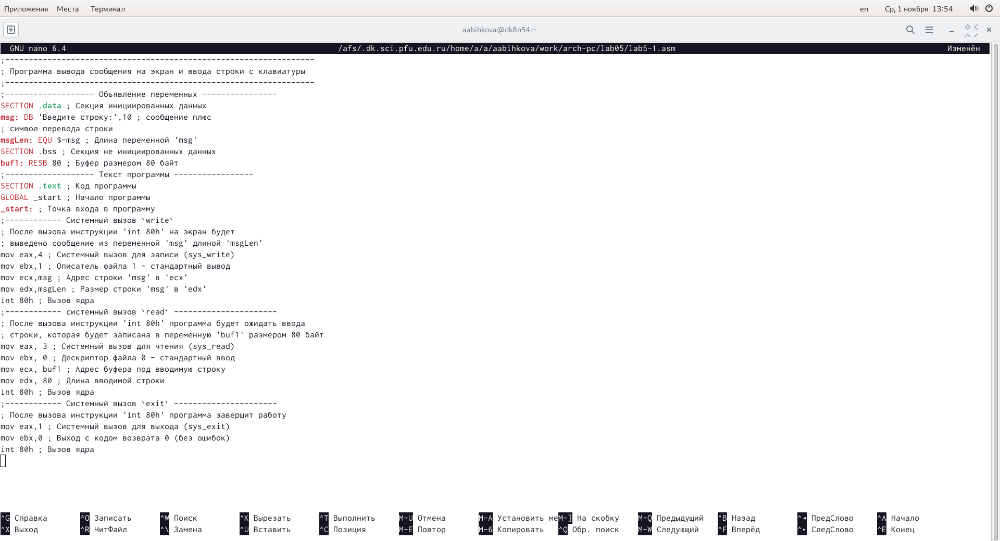

С помощью функциональной клавиши F3 открыла файл lab5-1.asm для просмотра и убедилась, что файл содержит текст программы.

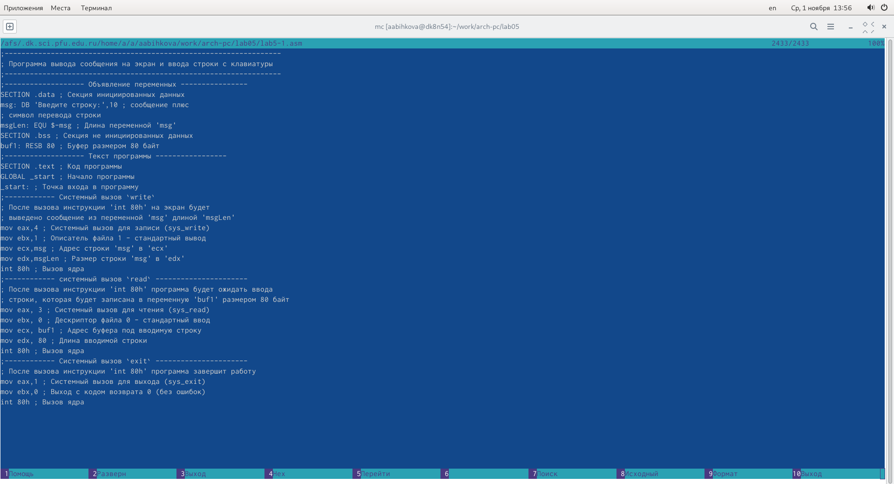

Оттранслировала текст программы lab5-1.asm в объектный файл. Выполнила компоновку объектного файла и запустила получившийся исполняемый файл. Ввела свое ФИО.

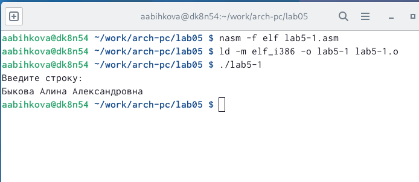

Скопировала файл in_out.asm в каталог с файлом lab5-1.asm с помощью функциональной клавиши F5.

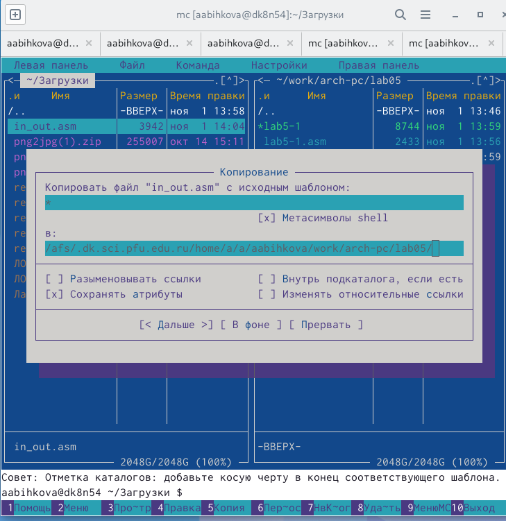

С помощью функциональной клавиши F6 создала копию файла lab5-1.asm с именем lab5-2.asm.

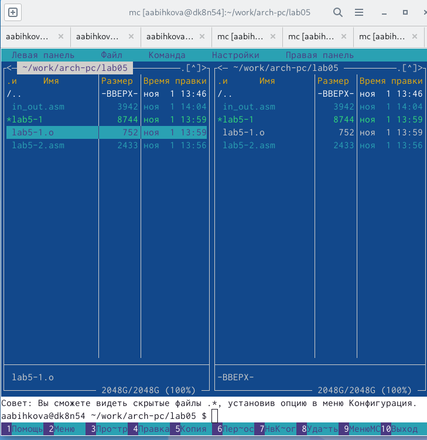

Исправила текст программы в файле lab5-2.asm с использование подпрограмм из внешнего файла in_out.asm. В файле lab5-2.asm заменила подпрограмму sprintLF на sprint.

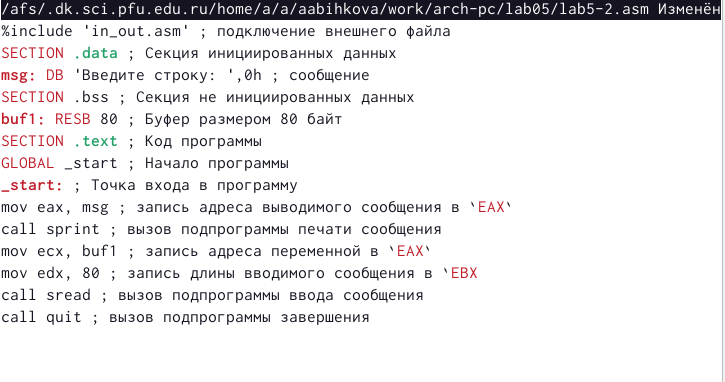

Создала исполняемый файл и проверила его работу.

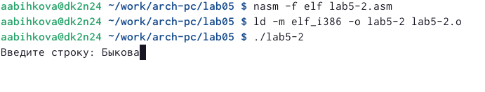

Разница между первым исполняемым файлом и вторым в том, что запуск первого запрашивает ввод с новой строки, а программа, которая исполняется при запуске второго, запрашивает ввод без переноса на новую строку, потому что в этом заключается различие между подпрограммами sprintLF и sprint.

# Задание для самостоятельной работы

Создала копию файла lab5-1.asm.

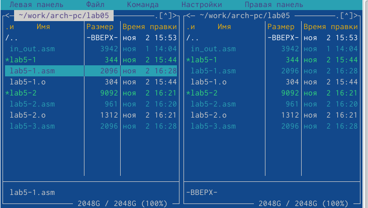

Внесла изменения в программу (без использования внешнего файла in_out.asm) и проверила работу исполняемого файла. 

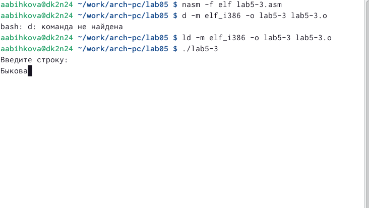

Создала копию файла lab5-2.asm.

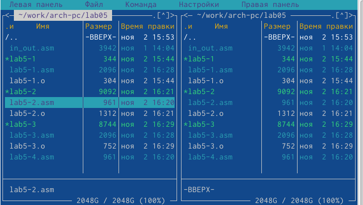

Исправила текст программы с использование подпрограмм из внешнего файла in_out.asm.

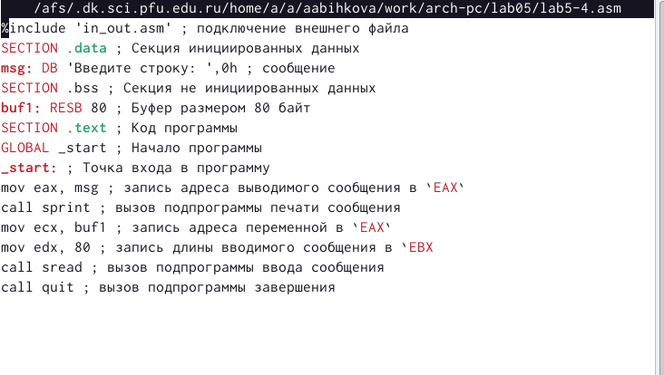

Проверила работу исполняемого файла.

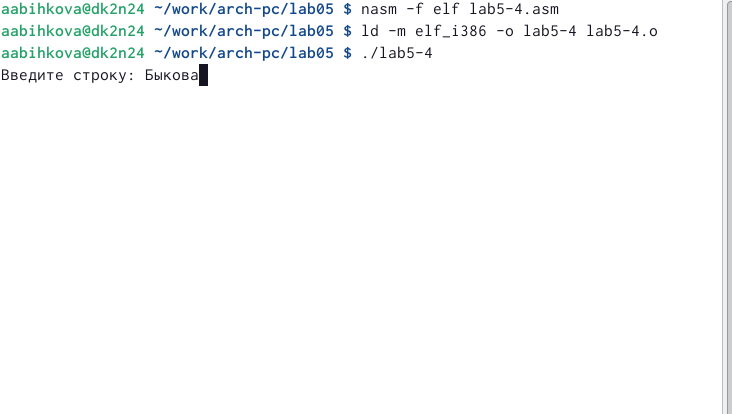

# Выводы

При выполнении данной лабораторной работы я приобрела практические навыки работы в Midnight Commander и освоила инструкции языка ассемблера mov и int.

