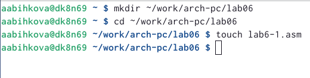
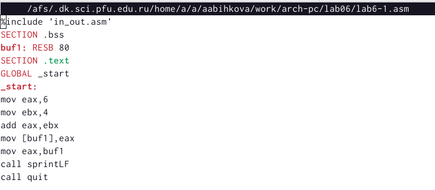

---
## Front matter
title: "Отчет по лабораторной работе №6"
subtitle: "Дисциплина:Архитектрура компьютера"
author: "Быкова Алина Александровна"

## Generic otions
lang: ru-RU
toc-title: "Содержание"

## Bibliography
bibliography: bib/cite.bib
csl: pandoc/csl/gost-r-7-0-5-2008-numeric.csl

## Pdf output format
toc: true # Table of contents
toc-depth: 2
lof: true # List of figures
lot: true # List of tables
fontsize: 12pt
linestretch: 1.5
papersize: a4
documentclass: scrreprt
## I18n polyglossia
polyglossia-lang:
  name: russian
  options:
	- spelling=modern
	- babelshorthands=true
polyglossia-otherlangs:
  name: english
## I18n babel
babel-lang: russian
babel-otherlangs: english
## Fonts
mainfont: PT Serif
romanfont: PT Serif
sansfont: PT Sans
monofont: PT Mono
mainfontoptions: Ligatures=TeX
romanfontoptions: Ligatures=TeX
sansfontoptions: Ligatures=TeX,Scale=MatchLowercase
monofontoptions: Scale=MatchLowercase,Scale=0.9
## Biblatex
biblatex: true
biblio-style: "gost-numeric"
biblatexoptions:
  - parentracker=true
  - backend=biber
  - hyperref=auto
  - language=auto
  - autolang=other*
  - citestyle=gost-numeric
## Pandoc-crossref LaTeX customization
figureTitle: "Рис."
tableTitle: "Таблица"
listingTitle: "Листинг"
lofTitle: "Список иллюстраций"
lotTitle: "Список таблиц"
lolTitle: "Листинги"
## Misc options
indent: true
header-includes:
  - \usepackage{indentfirst}
  - \usepackage{float} # keep figures where there are in the text
  - \floatplacement{figure}{H} # keep figures where there are in the text
---

# Цель работы

Освоение арифметических инструкций языка ассемблера NASM.

# Выполнение лабораторной работы

Создала каталог для программам лабораторной работы No 6, перешла в него и создала файл lab6-1.asm.

Перешла в lab6-1.asm и написала программу вывода значения регистра eax.

Создала исполняемый файл и запустила его.

Далее изменила текст программы и вместо символов, записала в регистры числа. Исправила текст программы следующим образом: заменила строки mov eax,'6' и mov ebx,'4' на строки mov eax,6 и mov ebx,4.

Создала исполняемый файл и запустила его. Вывелся символ с кодом 10, это символ перевода строки, этот символ не отображается при выводе на экран.

Создала файл lab6-2.asm в каталоге ~/work/arch-pc/lab06.

Ввела в него текст программы.

Создала исполняемый файл и запустила его. В результате работы программы мы получили число 106.

Далее изменила текст программы и вместо символов, записала в регистры числа. Исправила текст программы следующим образом: заменила строки mov eax,'6' и mov ebx,'4' на строки mov eax,6 и mov ebx,4. Создала исполняемый файл и запустила его. Результат: появилось число 10.

Далее заменила функцию iprintLF на iprint.

Создала новый исполняемый файл и запустила его. В первый раз 10 появилось на отдельной строке, а сейчас 10 появилось на той же строке, где и командная строка.

Создала файл lab6-3.asm в каталоге ~/work/arch-pc/lab06 и ввела текст программы вычисления арифметического выражения f(x) = (5 * 2 +3)/3

Создала исполняемый файл и запустила его.

Изменила текст программы для вычисления выражения f(x) = (4 * 6 + 2)/5.

Создала новый исполняемый файл и запустила его.

Создала файл variant.asm в каталоге ~/work/arch-pc/lab06.

Ввела текст программы в файл variant.asm.

Создала исполняемый файл (variant.asm) и запустила его. Получила вариант 17.

# Ответы на вопросы 

1. За вывод сообщения "Ваш вариант" отвечают строки кода:
 mov eax,rem
 call sprint
 
2. Инструкция mov ecx, x используется, чтобы положить адрес вводимой строки x в регистр; mov edx, 80 - запись в регистр edx длины вводимой строки; call sread - вызов подпрограммы из внешнего файла, обеспечивающей ввод сообщения с клавиатуры

3. call atoi используется для вызова подпрограммы из внешнего файла, которая преобразует ascii-код символа в целое число и записывает результат в регистр eax.

4. За вычисления варианта отвечают строки:
 xor edx,edx
 mov ebx,20
 div ebx
 inc edx

5. При выполнении инструкции div ebx остаток от деления записывается в регистр edx

6. Инструкция inc edx увеличивает значение регистра edx на 1

7. За вывод на экран результатов вычислений отвечают строки:
 mov eax,edx
 call iprintLF

# Выполнение заданий для самостоятельной работы

Создала файл lab6-4.asm в каталоге ~/work/arch-pc/lab06.

Написала программу вычисления выражения 18(x + 1)/6

Создала исполняемый файл и запустила его.

# Выводы

При выполнении данной лабораторной работы я освоила арифметические инструкции языка ассемблера NASM.
