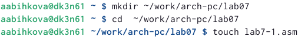

---
## Front matter
title: "Отчет по лабораторной работе №7"
subtitle: "Дисциплина: Архитектура компьютера"
author: "Быкова Алина Александровна"

## Generic otions
lang: ru-RU
toc-title: "Содержание"

## Bibliography
bibliography: bib/cite.bib
csl: pandoc/csl/gost-r-7-0-5-2008-numeric.csl

## Pdf output format
toc: true # Table of contents
toc-depth: 2
lof: true # List of figures
lot: true # List of tables
fontsize: 12pt
linestretch: 1.5
papersize: a4
documentclass: scrreprt
## I18n polyglossia
polyglossia-lang:
  name: russian
  options:
	- spelling=modern
	- babelshorthands=true
polyglossia-otherlangs:
  name: english
## I18n babel
babel-lang: russian
babel-otherlangs: english
## Fonts
mainfont: PT Serif
romanfont: PT Serif
sansfont: PT Sans
monofont: PT Mono
mainfontoptions: Ligatures=TeX
romanfontoptions: Ligatures=TeX
sansfontoptions: Ligatures=TeX,Scale=MatchLowercase
monofontoptions: Scale=MatchLowercase,Scale=0.9
## Biblatex
biblatex: true
biblio-style: "gost-numeric"
biblatexoptions:
  - parentracker=true
  - backend=biber
  - hyperref=auto
  - language=auto
  - autolang=other*
  - citestyle=gost-numeric
## Pandoc-crossref LaTeX customization
figureTitle: "Рис."
tableTitle: "Таблица"
listingTitle: "Листинг"
lofTitle: "Список иллюстраций"
lotTitle: "Список таблиц"
lolTitle: "Листинги"
## Misc options
indent: true
header-includes:
  - \usepackage{indentfirst}
  - \usepackage{float} # keep figures where there are in the text
  - \floatplacement{figure}{H} # keep figures where there are in the text
---

# Цель работы

Изучение команд условного и безусловного переходов. Приобретение навыков написания
программ с использованием переходов. Знакомство с назначением и структурой файла
листинга.

# Выполнение лабораторной работы

Создала каталог для программам лабораторной работы № 7, перешла в него и создала файл lab7-1.asm. 

Ввела в файл lab7-1.asm текст программы из листинга.

Создала исполняемый файл и запустила его. Результат работы данной программы:
Сообщение № 2
Сообщение № 3

Изменила программу таким образом, чтобы она выводила сначала ‘Сообщение № 2’, потом ‘Сообщение № 1’ и завершала работу.

Создала исполняемый файл и запустила его. Результат работы данной программы:
Сообщение № 2
Сообщение № 1

Изменила текст программы в соответствии с листингом, изменив инструкции jmp.

Создала исполнямый файл и проверила его работу. Результат работы данной программы:
Сообщение № 3
Сообщение № 2
Сообщение № 1

Создала файл lab7-2.asm в каталоге ~/work/arch-pc/lab07.

Ввела в файл lab7-2.asm текст программы из листинга.

Создала исполнямый файл и проверила его работу для разных значений B.

Создала файл листинга для программы из файла lab7-2.asm и открыла его с помощью текстового редактора mcedit.

В строке 8 содержится адрес "00000003", машинный код "803800" и содержимое строки кода "cmp byte [eax], 0".
В строке 10 содержится адрес "00000008", машинный код "40" и содержимое строки кода "inc eax".
В строке 24 содержится адрес "00000010", машинный код "51" и содержимое строки кода "push ecx".

Открыла файл с программой lab7-2.asm и в инструкции удалила один операнд. Выполнила трансляцию. Если в коде появляется ошибка, то ее описание появится в файле листинга.

# Задание для самостоятельной работы 

Вариант 17
 
Задание №1

Создала файл lab7-3.asm в каталоге ~/work/arch-pc/lab07 и написала программу нахождения наименьшей из 3 целочисленных переменных a,b и c. 
a=68
b=26
c=12

Создала исполняемый файл и запустила его. Результат: программа вывела наименьшее число 12.

Задание №2

Создала файл lab7-4.asm в каталоге ~/work/arch-pc/lab07 и написала программу, которая для введенных с клавиатуры значений x и a вычисляет значение заданной функции f(x) и выводит результат вычислений. 

# Выводы

Я изучила команы условного и безусловного переходов и научилась писать программы с использованием этихм переходов.

