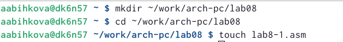

---
## Front matter
title: "Отчет по лабораторной работе №8"
subtitle: "Архитектура компьютера"
author: "Быкова Алина Александровна"

## Generic otions
lang: ru-RU
toc-title: "Содержание"

## Bibliography
bibliography: bib/cite.bib
csl: pandoc/csl/gost-r-7-0-5-2008-numeric.csl

## Pdf output format
toc: true # Table of contents
toc-depth: 2
lof: true # List of figures
lot: true # List of tables
fontsize: 12pt
linestretch: 1.5
papersize: a4
documentclass: scrreprt
## I18n polyglossia
polyglossia-lang:
  name: russian
  options:
	- spelling=modern
	- babelshorthands=true
polyglossia-otherlangs:
  name: english
## I18n babel
babel-lang: russian
babel-otherlangs: english
## Fonts
mainfont: PT Serif
romanfont: PT Serif
sansfont: PT Sans
monofont: PT Mono
mainfontoptions: Ligatures=TeX
romanfontoptions: Ligatures=TeX
sansfontoptions: Ligatures=TeX,Scale=MatchLowercase
monofontoptions: Scale=MatchLowercase,Scale=0.9
## Biblatex
biblatex: true
biblio-style: "gost-numeric"
biblatexoptions:
  - parentracker=true
  - backend=biber
  - hyperref=auto
  - language=auto
  - autolang=other*
  - citestyle=gost-numeric
## Pandoc-crossref LaTeX customization
figureTitle: "Рис."
tableTitle: "Таблица"
listingTitle: "Листинг"
lofTitle: "Список иллюстраций"
lotTitle: "Список таблиц"
lolTitle: "Листинги"
## Misc options
indent: true
header-includes:
  - \usepackage{indentfirst}
  - \usepackage{float} # keep figures where there are in the text
  - \floatplacement{figure}{H} # keep figures where there are in the text
---

# Цель работы

Приобретение навыков написания программ с использованием циклов и обработкой
аргументов командной строки.

# Выполнение лабораторной работы

Создала каталог для программам лабораторной работы No 8, перешла в него и создала файл lab8-1.asm.

Ввела программу из листинга в lab8-1.asm.

Создала исполняемый файл и проверила его работу. Результат: вышли числа от 15 до 1 (по убыванию). 

Изменила текст программы добавив измененение значение регистра ecx в цикле.

Создала исполняемый файл и проверила его работу. Результат: вывел все нечетные числа, которые маньше 6.

Внесла изменения в текст программы добавив команды push и pop (добавления в стек и извлечения из стека) для сохранения значения счетчика цикла loop.

Создала исполняемый файл и проверила его работу. Результат: вышли числа от 5  до 0 (по убыванию). 

Создала файл lab8-2.asm и ввела программу из листинга.

Создала исполняемый файл и проверила его работу. Результат: вывел аргументы 1 2 3 по возрастанию.

Создала файл lab8-3.asm и ввела программу из листинга.

Создала исполняемый файл и проверила его работу. Результат: все числа сложились.

Изменила текст программы из листинга для вычисления произведения аргументов командной строки.

Создала исполняемый файл и проверила его работу. Результат: произведение всех чисел.

#Задание для самостоятельной работы

Cоздала файл lab8-4.asm и написала программу, которая находит сумму значений функции f(x). (вариант 17)

Создала исполняемый файл и проверила его работу.

# Выводы

В результате выполнения работы я получила навыки написания программ с использованием циклов и обработкой
аргументов командной строки.

