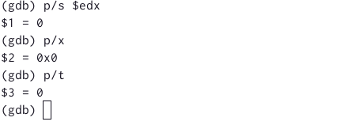
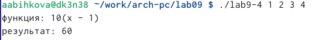

---
## Front matter
title: "Отчет по лабораторной работе №9"
subtitle: "Архитектура компьютера"
author: "Быкова Алина Александровна"

## Generic otions
lang: ru-RU
toc-title: "Содержание"

## Bibliography
bibliography: bib/cite.bib
csl: pandoc/csl/gost-r-7-0-5-2008-numeric.csl

## Pdf output format
toc: true # Table of contents
toc-depth: 2
lof: true # List of figures
lot: true # List of tables
fontsize: 12pt
linestretch: 1.5
papersize: a4
documentclass: scrreprt
## I18n polyglossia
polyglossia-lang:
  name: russian
  options:
	- spelling=modern
	- babelshorthands=true
polyglossia-otherlangs:
  name: english
## I18n babel
babel-lang: russian
babel-otherlangs: english
## Fonts
mainfont: PT Serif
romanfont: PT Serif
sansfont: PT Sans
monofont: PT Mono
mainfontoptions: Ligatures=TeX
romanfontoptions: Ligatures=TeX
sansfontoptions: Ligatures=TeX,Scale=MatchLowercase
monofontoptions: Scale=MatchLowercase,Scale=0.9
## Biblatex
biblatex: true
biblio-style: "gost-numeric"
biblatexoptions:
  - parentracker=true
  - backend=biber
  - hyperref=auto
  - language=auto
  - autolang=other*
  - citestyle=gost-numeric
## Pandoc-crossref LaTeX customization
figureTitle: "Рис."
tableTitle: "Таблица"
listingTitle: "Листинг"
lofTitle: "Список иллюстраций"
lotTitle: "Список таблиц"
lolTitle: "Листинги"
## Misc options
indent: true
header-includes:
  - \usepackage{indentfirst}
  - \usepackage{float} # keep figures where there are in the text
  - \floatplacement{figure}{H} # keep figures where there are in the text
---

# Цель работы

Приобретение навыков написания программ с использованием подпрограмм. Знакомство с методами отладки при помощи GDB и его основными возможностями

# Выполнение лабораторной работы

Создала каталог для выполнения лабораторной работы No 9, перешла в него и создала файл lab09-1.asm.

Ввела в файл lab09-1.asm текст программы из листинга. f(x)=2x+7

Создала исполняемый файл и проверила его работу.

Изменила текст программы, добавив подпрограмму _subcalcul в подпрограмму _calcul, для вычисления выражения f(g(x)). 
f(x)=2x+7, g(x)=3x-1 

Создала исполняемый файл и проверила его работу.

Создала файл lab09-2.asm с текстом программы из Листинга 9.2. (Программа печати сообщения Hello world!).

Получила исполняемый файл; Загрузила исполняемый файл в отладчик gdb; Проверила работу программы, запустив ее в оболочке GDB с помощью команды run; Для более подробного анализа программы установила брейкпоинт на метку _start, с
которой начинается выполнение любой ассемблерной программы, и запустила её; Посмотрела дисассимилированный код программы с помощью команды disassemble; Переключилась на отображение команд с Intel’овским синтаксисом, введя команду set disassembly-flavor intel; Включила режим псевдографики для более удобного анализа программы.

На предыдущих шагах была установлена точка останова по имени метки (_start). Проверила это с помощью команды info breakpoints.

Установила еще одну точку останова по адресу инструкции. Посмотрела информацию о всех установленных точках останова.

Посмотрела содержимое регистров с помощью команды info registers.

Посмотрела значение переменной msg1 по имени.

Посмотрела значение переменной msg2 по адресу.

Изменила первый символ переменной msg1.

Заменила w на W во второй переменной msg2.

Вывела в различных форматах (в шестнадцатеричном формате, в двоичном формате и в символьном виде) значение регистра edx.

С помощью команды set изменила значение регистра ebx. 

Завершила выполнение программы с помощью команды continue и вышла из GDB с помощью команды quit.

Скопировала файл lab8-2.asm, созданный при выполнении лабораторной работы No8, с программой выводящей на экран аргументы командной строки в файл с именем lab09-3.asm и создала исполняемый файл.

Загрузила исполняемый файл в отладчик, указав аргументы.

Установила точку останова и запустила ее.

Посмотрела адрес вершины стека, который хранится в регистре esp, число аргументов 5. Посмотрела остальные позиции стека (по адесу [esp+4] располагается адрес в памяти где находиться имя программы, по адесу [esp+8] храниться адрес первого аргумента, по аресу [esp+12] – второго и т.д.).

# Задание для самостоятельной работы

1. Преобразовала программу из лабораторной работы №8 (задание №1 для самостоятельной работы), реализовав вычисление значения функции f(x) как подпрограмму.

Создала исполняемый файл и проверила его работу.

Ввела программу из листинга вычисления выражения (3 + 2) * 4 + 5

Создала исполняемый файл и проверила его работу. При запуске данная программа дает неверный результат.

Изменила текст программы для верного результата. 

Создала исполняемый файл и проверила его работу. Вывел верный результат.

# Выводы

Приобрела навыки написания программ с использованием подпрограмм. Познакомилась с методами отладки при помощи GDB и его основными возможностями

